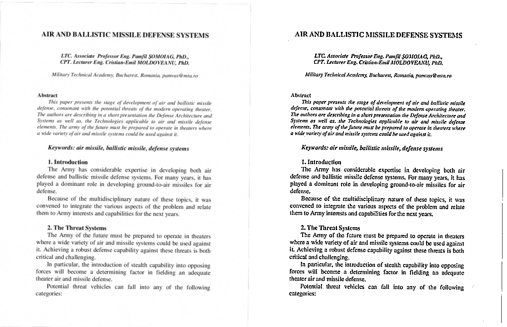
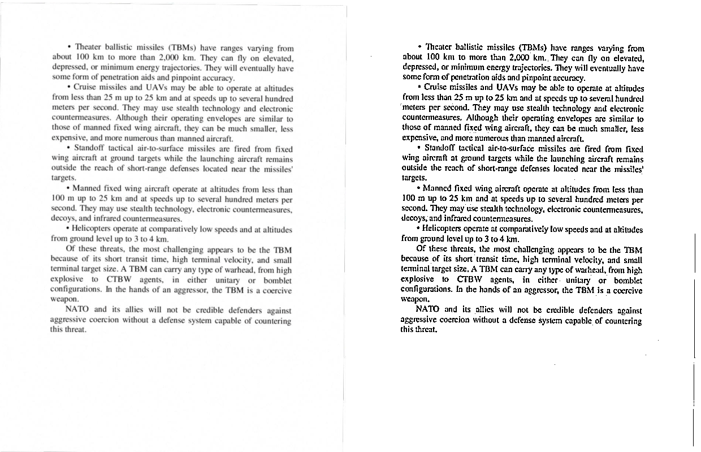
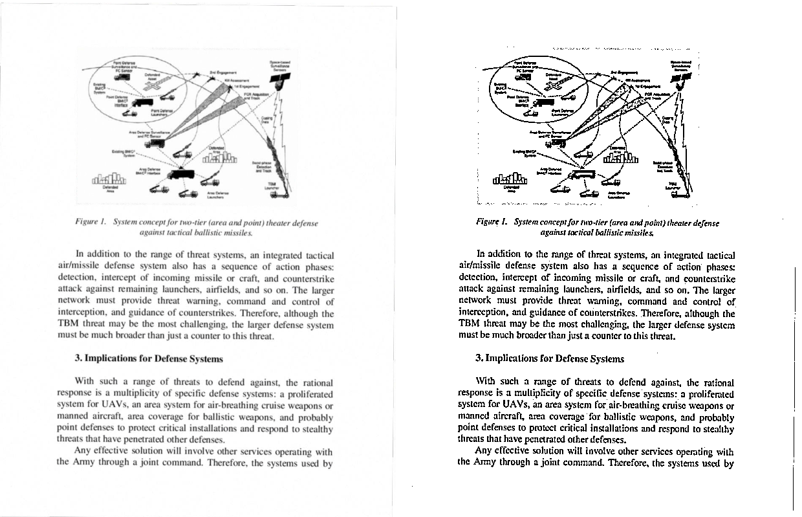
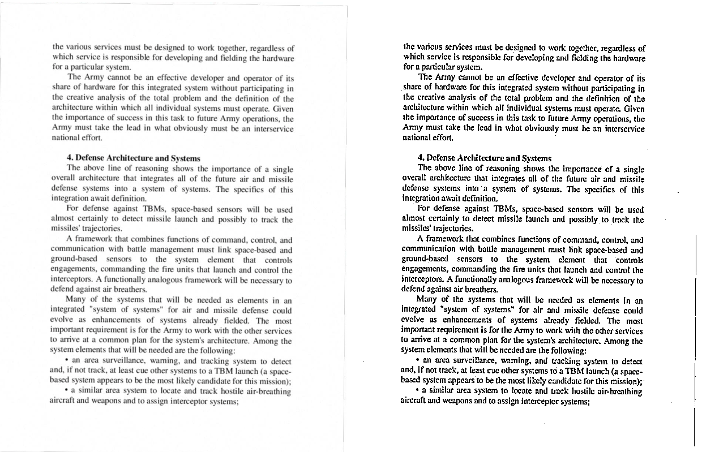
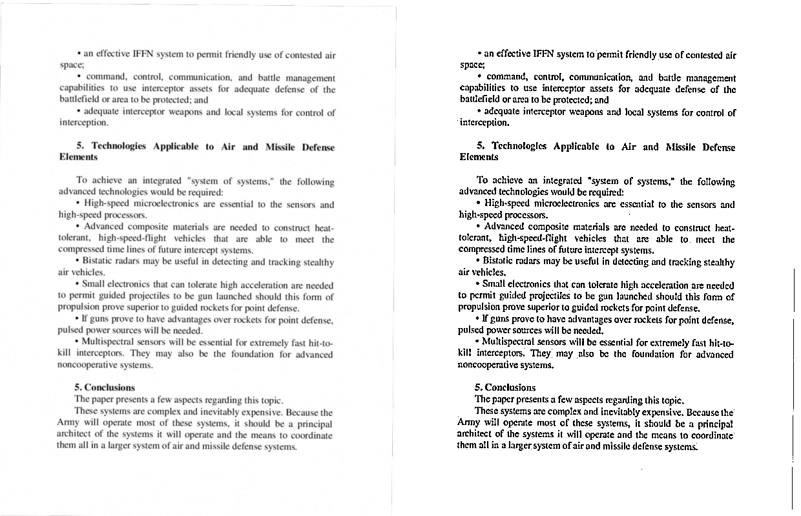

# Preprocessing results

Preprocessing steps:
* grayscale
* adaptive gaussian threshold
* fastNlMeansDenoising
* deskewing
* cropping

# Run line

``
py main.py --path 'path to pdf file' --show 'True for showing results'
``
