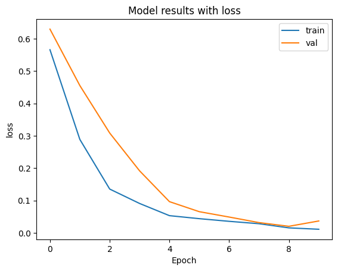
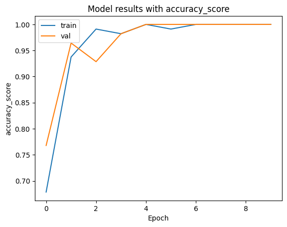
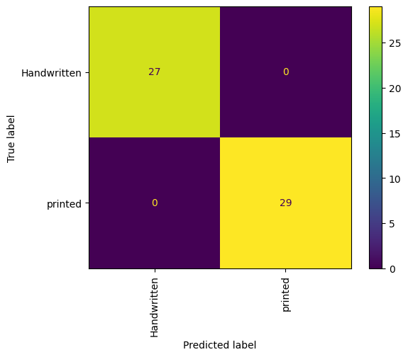
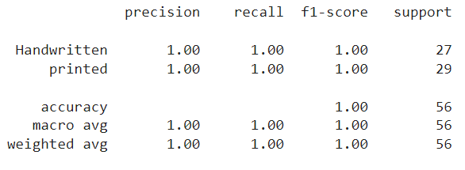

# Convert Scanned Files to DOCX Using OCR

## Overview
This project converts scanned PDF files into editable DOCX files using Optical Character Recognition (OCR). It processes images, extracts text while preserving layout, and distinguishes between handwritten and printed text for improved accuracy.

## Features
- Converts scanned PDFs to DOCX format.
- Image preprocessing for better OCR accuracy.
- Layout parser to retain document structure.
- Machine learning model to differentiate between handwritten and printed text.
- Utilizes text-to-image models to enhance document reconstruction.

## Installation
Ensure you have the required dependencies installed:

```bash
pip install -r requirements.txt
```

## Usage
Run the following command to convert a scanned PDF to DOCX:

```bash
python ocr.py --path "path_to_pdf_file" --save True
```

- `--path`: Path to the scanned PDF file.
- `--save`: Set to `True` to save the output as a DOCX file.

## Process Flow
1. **Image Processing**: Enhances scanned images using techniques like noise reduction, binarization, and skew correction.
2. **Layout Parsing**: Identifies document structure (headings, paragraphs, tables) to retain formatting.
3. **Text Recognition**: Applies trained image classifier to distinguish between handwritten and printed text.
4. **Text-to-Image Model**: Uses pytesseract and easyocr to extract text from images.
5. **DOCX Generation**: Assembles recognized text and layout into a structured DOCX file.


# Classifier training

## Model Architecture
Model consists of 2 parts:
* pre-trained feature extractor(vgg19_bn)
* 1-layer classifier head with dropout


Training params
* loss - bce
* optimizer - Adam with lr=1e-3
* scheduler - ReduceLROnPlateau

## Results
Training results for 10 epochs and cross-validation with 3 folds







